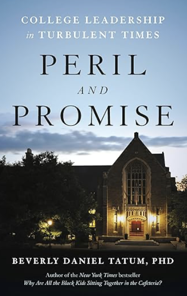

> "*Goede leiders zijn juist in een tijd als deze nodig.”*”\
> - B.D. Tatum

 

Er speelt nogal wat op de universiteiten tegenwoordig: de COVID-pandemie twee jaar lang en de naweeën ervan, de oorlogen in Oekraïne en Gaza, de rechten van de LHBTQ+-gemeenschap en de mentale problemen van jongeren. In Amerika is er ook nog de dreiging van het wapenbezit op de instellingen. En überhaupt de vraag wat het hoger onderwijs oplevert en wat er in de tegenwoordige samenleving van het hoger onderwijs mag worden verwacht. Personen die de universiteiten en colleges leiden (of dat nou presidenten zijn, decanen, voorzitters of afdelingshoofden zijn) hebben het zwaar tegenwoordig. Dat roept nogal eens de vraag op wie deze baan nog wil hebben.

Ook Beverly Daniel Tatum krijgt als oud-president van enkele Amerikaanse universiteiten regelmatig de vraag voorgelegd. Het daagde haar in ieder geval uit daar een antwoord op te geven. Beverly Daniel Tantum werkte dertien jaar (1989-2002) op Mount Holyoke-vrouwencollege in Massachusetts, eerst als hoogleraar psychologie, vervolgens als decaan en president (en later nog een keer een jaar als interim-president). Daarna werd ze president van het Spelman College in Atlanta, ook een vrouwencollege. In 2015 ging ze met pensioen en nam zich voor over haar werk nog eens een boek te schrijven. Het duurde even omdat ze na de dood van George Floyd bij allerlei discussies betrokken raakt. Het boek over educatief leiderschap dat ze in gedachten had was een soort memoires en verscheen recent onder de titel *Peril and Promise. College Leadership in Turbulent Times*. Het is een mooi en inspirerend boek omdat het zo’n goed en algemeen beeld geeft van Amerikaanse hogescholen en universiteiten, de maatschappelijke problemen die er de afgelopen jaren spelen en wat er van leiders van dit soort instellingen mag worden verwacht. Het boek leest als een rustig baken in turbulente tijden.

 

Als we aan het hoger onderwijs van Amerika denken, denken we al snel aan universiteiten als Harvard, Stanford, MIT, Princeton, Chicago of Berkley. Maar er zijn daar nog zo’n kleine 4000 andere instellingen van hoger onderwijs met meer dan 15 miljoen studenten. Het hoger onderwijs is er een heel divers landschap met vierjarige publieke instellingen (48%), tweejarige publieke instellingen (29%), vierjarige private non-profit instellingen (17%) en nog een restantje andersoortige instellingen. Deze typen instellingen verschillen sterk in raciale en etnische verdelingen van hun studentengroepen. Het leiderschap van deze instellingen is daarentegen veel minder divers. Het zijn vooral oudere witte mannen met een gemiddelde leeftijd van 60 jaar die er leiding aan geven en 33% van die leiders ss vrouw. Van de grote groep mannelijke leiders is 25% van kleur. Van de kleinere groep vrouwelijke leiders is 10% van kleur, waar Tatum er één van is.  

Tatum groeit op als enige zwarte student in haar klas maar komt wel uit een gezin met een sterkte onderwijsambitie. Zij wordt psychologe, specialiseert zij zich in het thema ras en identiteit en werkt zich op tot hoogleraar op het Mount Holyoke instituut. Zij schrijft over dat onderwerp het Populaire boek *Why Are All the Black Kids Sitting Together in the Cafetaria? And Other Conversations About Race*. Wanneer Clinton president wordt in 1993 wordt het thema ras en identiteit op de agenda zet en komt zij zelf met haar boek volop in de belangstelling te staan. Het is in deze periode dat zij zich afvraagt of zij niet meer kan doen tegen segregatie en aan de wijze waarop in het onderwijs wordt omgegaan met verschillen. Ze wordt decaan op haar eigen Mount Holyoke instituut en vanuit die positie organiseert ze dialogen tussen groepen. Zij stelt er een gemeenschappelijke visie voor die ze in dit boek als het ABC definieert en waarmee ze de leeromgevingen op haar instelling sterker wil maken: *aanmoedigen* van identiteitsvorming van alle studenten en dan met name van de gemarginaliseerde groepen, *bouwen* van een gemeenschap waar iedereen zich thuis voelt en het *cultiveren* van de leiderschapscapaciteiten van de studenten die bij deze tijd passen.   

Haar ABC lijkt natuurlijk erg op DEI (Diversiteit, Egaliteit en Inclusiviteit) waar tegenwoordig van hogerhand zoveel weerstand tegen is. Waar Trump en de zijnen dit alles onder de noemer van ‘woke’ plaatsen en er alles aan doen om het onderwijs ervan te vrijwaren, benadrukt Tatum juist de onderwijskundige en pedagogische waarde van een aanpak die studenten het gevoel geeft erbij te horen. Want wat kun je erop tegen hebben, vraagt Tatum zich terecht hardop af, als studenten een omgeving vinden waar ze het beste uit zichzelf kunnen halen? In een gezonde leeromgeving gaat het volgens Tatum om de relaties tussen groepen, hoe studenten worden voorbereid op een diverse wereld en keuzes leren maken waarbij ze ook rekening houden met de ander. Zij laat haar boek heel duidelijk het verschil zien tussen haar dialogische aanpak en die van de ‘war on woke’ om en hoe haar aanpak beter werkt om spanning tussen inclusiviteit en vrijheid van meningsuiting op te lossen. Boeken verbieden, cursussen schrappen en alles eruit halen dat te maken heeft met de ‘kritische ras theorie’ is niet de oplossing voor de problemen waar we tegenwoordig mee te maken hebben. Tatum verwacht meer van begrip en respect, zo simpel is het.   

De spanning tussen een inclusieve leeromgeving voor iedereen en de vrijheid van meningsuiting wordt duidelijk met het 7 Oktober geweld in Israël en het geweld in Gaza dat erop volgt. Het veroorzaakt veel onrust op de universiteiten en hogescholen en vraagt veel van het leiderschap, zeker wanneer de politiek zich er heel actief mee bezig gaat houden en disciplinaire maatregelen eist van de leiders. Voor Tatum is het duidelijk dat de universiteit de plaats is waar mensen met verschillende achtergronden en levenservaringen samenkomen en van elkaar leren in betekenisvolle interactie. Het is de taak van een leider van hoger onderwijs om deze waarden te verdedigen, juist in turbulente tijden.   

Om een goed beeld te schetsen van haar manier van werken als president van een universiteit, gaat zij uitgebreid in op een voorbeeld op het Spelman instituut aan het einde van de Covid-19-pandemie. Het voorbeeld maakt duidelijk hoe Tatum operereert en laat zien wat volgens haar een succesvolle aanpak is. Wanneer de mondkapjesplicht wordt versoepeld, bezet een groep studenten vijfentwintig dagen lang de gangen van haar bestuursgebouw. Die studenten zijn het niet eens met de versoepeling van de maatregelen. Tatum ziet de bezetting niet als een ordeverstoring die direkt onderdrukt moet worden. Zij kiest voor een andere aanpak. Zij doet zelf een stap vooruit en verplaatst haar eigen werkzaamheden uit het gebouw. Zij probeert een harde confrontatie met deze studenten te vermijden. Deze aanpak zorgt voor de-escalatie en ook dat het gesprek gevoerd kan blijven worden. Zo blijft het institutionele gezag net zo goed als het vertrouwen van de studenten zelf overeind. Zij contrasteert haar aanpak met de gewelddadige verwijdering van demonstranten aan andere universiteiten. Wat zij ons meegeeft is: neem nooit een beslissing die als totale verrassing komt, bel niet onmiddellijk de politie, luister naar zoveel mogelijk stemmen voordat je handelt.   

Het boek laat ook zien met welke problemen leiders van deze instituten dagelijks te maken hebben. In het boek beschrijft ze hoe ze omgaat met veiligheid en gezondheid van studenten (ze beschrijft hoe ze met de moord van een van de studenten omgaat en met de mentale problematiek van studenten). Ze behandelt het thema daling van studentenaantal en dat alle universiteiten te maken hebben met het demografische probleem van dreigende instroomdaling). Ze laat zien hoe verschillende universiteiten omgaan met nieuwe ontwikkelingen. Elke leider heeft te maken met financiële beperkingen (wat lang niet iedereen goed begrijpt), ook Tatum. En dan is er nog de wijze waarop je al leider omgaat met gedeeld bestuur en met faculteit, personeel, studenten en toezichthouders. Die zijn het lang niet altijd met elkaar eens zijn en daarin kun je als leider wel het verschil maken. Tatum maakt in dit boek het modern educatief leiderschap heel concreet en inzichtelijk.   

 

Het boek is geschreven vanuit het perspectief van een leider van twee specifieke instellingen. Het zijn zwarte vrouwenuniversiteiten, gericht op brede academische vorming en met kleinschalig onderwijs. Maar het zijn ook gemiddelde instelling en met haar ervaringen maakt ze haar ervaringen overdraagbaar. Het hoger onderwijs heeft volgens haar de taak om studenten aan te moedigen kritisch na te denken over de belangrijke kwesties die er in de samenleving spelen en om nieuw leiderschap te ontwikkelen en te vormen. Tatum ziet universiteiten en hogescholen als bakens van hoop en al haar inspanningen zijn er op gericht om nieuwe generaties te inspireren en eraan bij te dragen dat zij in de toekomst slagen. Universiteiten en hogescholen zijn voor haar gemeenschappen van probleemoplossers, die creatieve denkers voor de toekomst wil aantrekken en vormen. Tatum wil laten zien dat leiders van deze instellingen wel degelijk impact kunnen hebben van al het werk dat zij dagelijks verrichten. Ondanks al de uitdagingen waarmee ze worden geconfronteerd, is de campus nog steeds een prachtige plek om te zijn. Nog steeds is het de moeite waard om leider te worden van op een universiteit of hogeschool, ook in deze turbulente tijd.   

Precies een jaar geleden stuurde de Traump administratie die beruchte ‘Dear Colleague’ en anti-DEI brief uit waarin onderwijsinstellingen werden opgeroepen om alle vormen van op ras gerichte programma’s, voorzieningen en financiële steun af te schaffen. Vanaf dat moment werden deze als illegaal bestempeld. Instellingen kregen veertien dagen de tijd om te reageren en er werd gedreigd met stopzetten van financiële hulp. Tatums doen en denken zal daar zeker onder vallen. *Peril and Promise* is juist nu een belangrijk en waardevol boek. Niet omdat het vol nieuwe ideeën zit. Het is de ervaring en het dialogisch perspectief van Tatum dat het boek interessant maakt. Iedere goede leider wil eraan bijdragen dat een organisatie floreert en uitblinkt en zij laat zien wat daar bij komt kijken. Het is interessant voor iedereen die een verantwoordelijk baan in het onderwijs heeft of de ambitie heeft om er te gaan werken. Maar ook anderen (ouders, bestuurders, politici en burgers) die zich zorgen maken over de toekomst van universiteiten, vinden in dit boek dat wijze en rustige baken in turbulente tijd. Sommigen vinden het misschien verleidelijk om het hoger onderwijs af te schrijven als hopeloos gebroken, anderen verdedigen het kritiekloos. Tatum biedt een nuchtere analyse van de problemen, wat je kunt doen, wat jouw verantwoordelijkheid is en wat het oplevert. Een goed tegengeluid in deze tijd.   

 

Tatum, B.D. (2025). *Peril and Promise. College Leadership in Turbulent Times.* New York: Basic Books.

