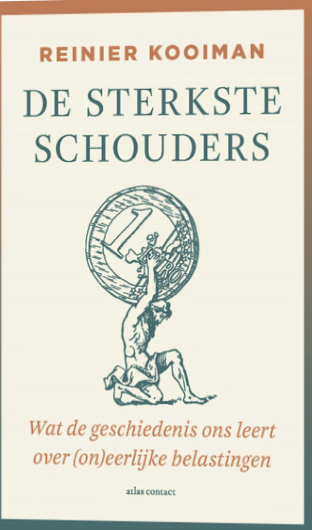

> "*Waarom zou de staat bij voorbaat een groot deel van de beroeps-bevolking de kans ontnemen om vermogen op te bouwen? Wat is de rechtvaardiging voor een lastenverdeling die vermogensongelijkheid vergroot? Het wordt tijd dat zij die de wereld bezitten ook haar lasten helpen dragen.””*”\
> - Reinier Kooiman

 

Iedereen heeft er mee te maken en toch gaat het er maar weinig over: belasting. Zo ongeveer begint Reinier Kooimans inzichtelijk boek *De sterkste schouders. Wat de geschiedenis ons leert over (on)eerlijke belastingen*. Onze kennis over belasting is heel beperkt en de politici die er beslissingen over hebben te nemen, weten ook lang niet allemaal hoe de belasting precies werkt. Het is ongelofelijk complex, de wetgeving is niet te volgen en van de hoeveelheid regels kan nauwelijks iemand nog iets maken. Belasting is iets voor vakspecialisten geworden en die zijn er volop. Nederland alleen al heeft 63 hoogleraren die zich met belastingrecht bezighouden. Belasting is een technocratisch onderwerp geworden. Kooiman schrijft dat we hier met elkaar in een soort drijfzand terecht zijn gekomen en dat we stapstenen nodig hebben om eruit te komen en richting te geven.    
Als we onze weerzin tegen dit saaie en ondoorgrondelijke onderwerp eens aan de kant zetten en er met andere ogen naar kijken, zoals Kooiman dat met ons in dit boek doet, zien we dat belasting niet meer alleen iets zou moeten zijn voor een kleine, selecte groep experts. De basisgedachten van het hele belastingstelsel gaan ons allen aan en voor een democratische samenleving is nodig dat burgers en politiek daarover een goed oordeel kunnen vormen. Een democratische samenleving vraagt van ons dat we met elkaar kunnen beoordelen of de verdeling van de gelden wel eerlijk en rechtvaardig gebeurt. Belasting is een publieke zaak. Belastingrecht is in de geschiedenis zwaar bevochten en dat gevecht zal niet ophouden. Het is goed dat Reinier Kooiman ons op andere gedachten probeert te brengen, niet door over tarieven en boxen te praten maar over de geschiedenis ervan en de principes eronder. Kooiman laat ons nadenken over hoe we met elkaar de wereld eerlijker kunnen verdelen.     

 

In de feodale Europese samenleving was alle grond van de koningen en zijn onderdanen en zij konden van anderen vragen wat zij wilden. Het ideaal van rechtvaardige en eerlijke belastingen is in die tijd volledig uit het zicht. In vergelijking met het oude Romeinse Rijk, waar nog wel over het systeem werd gedacht, was het feodale Europa een primitieve uithoek geworden. In de twaalfde eeuw verandert er wat in Italië. Dan zijn er stadsstaten zoals Perugia, Florence, Venetië, Genua waar wel principes van rechtvaardige belastingheffing worden toegepast en de inzichten uit de Romeinse tijd opnieuw werden doordacht. De belasting werd daar geheven op basis van het vermogen van de inwoners en belasting gaf mensen daarvoor wat terug, zoals veiligheid en deelname aan handel. Daar wilde je graag bij horen. Op een gegeven moment werden er nieuwe discussies gevoerd, die dan gingen over de verdeling van de eigendommen en over de grenzen; wie hoorden erbij en wie hadden de rechten? En dan had je ook nog de kerk die eigen geld ophaalde en vrijgesteld was van belasting. Het hele systeem van redelijke verdeling ging ten onder toen vooral de rijken steeds meer wisten te profiteren van het systeem. Het ideaal van een rechtvaardige verdeling van de lasten raakte er verder door vertroebeld en de rijken konden steeds meer vermogen opbouwen. Van de gelijke vermogensverdeling bleef er steeds minder over.    
	Einde achttiende eeuw werd er anders tegen de principes van belastingheffing aangekeken. Het is Adam Smith en andere verlichte denkers die vonden dat belasting een nuttig doel moest hebben. Het heffen ervan mocht niet willekeurig zijn, moest op recht gebaseerd zijn en naar draagkracht worden opgebouwd. Er komen nieuwe vormen van belasting, gebaseerd op inkomen en niet meer op vermogen. De belastingregels werden op het economisch systeem afgestemd. Het kapitaal belasten zou de economische groei verstoren. Tegelijk konden meer mensen stemmen en werden de maatschappelijk inbreng verbreedt en de privileges van de adel en de kerk afgebouwd. Toch leidde dat niet tot meer maatschappelijke gelijkheid want persoonlijke privileges maken plaats voor fiscale bevoordeling van kapitaalbezitters. De open bijdrage aan de belasting met een eerlijke afdracht naar draagkracht plaats maakt voor verborgen belastingheffing als ideaal. Hierdoor werd het ook steeds moeilijker om te beoordelen of individuen of bedrijven wel voldoende betaalden. Het zijn niet meer de juristen die aan de basis staan van het belastingstelsel, maar de economen. Er komt een technocratische blik op het belastingsysteem en dat is een blik van binnenuit. Er wordt in ieder geval niet meer nagedacht over de democratische legitimatie van het systeem. Het gaat nu om wetten en regels en niet meer om de principes.   
	In de twintigste eeuw vond er een enorme schaalvergroting plaatsg en zijn de belastingsystemen overal behoorlijk op elkaar gaan lijken. De tarieven staan vast en de opbrengsten zijn variabel, afhankelijk van economische en demografische veranderingen. Ook de omvang van belasting nam sterk toe omdat veel van de private naar de publieke sector wordt overgeheveld. De meeste belastingen werden vooral uit het inkomen gehaald aangevuld door indirecte belastingen uit consumpties en transacties. De vermogensbelasting was daarmee vergeleken laag. Er kwam een grote hoeveelheid belastingen waardoor het steeds moeilijker werd om te bepalen wie precies wat betaalt.    
En dit is nog steeds het geval. Het beperkte onderzoek naar alle belastingen dat er opgeteld is, gaat over Frankrijk, Nederland en de VS en maakt duidelijk dat de belastingdruk voor de laagste inkomsten nauwelijks verschilt van de rest van de bevolking en dat bij de hoogste inkomens de laagste belastingdruk wordt gemeten. Een daling die in ons eigen land eerder nog eerder inzet dan in Frankrijk en de VS. Dit soort onderzoek maakt duidelijk dat indirecte belasting als btw en accijnzen veel zwaarder op de lagere inkomens drukt dan op de hogere inkomens en van progressieve inkomstenbelasting blijft er zo niet heel veel meer over. De laagste inkomsten hebben nauwelijks de mogelijkheid om kapitaal op te bouwen. Het kapitaal van de allerrijksten bereidt zich verder uit omdat zij de mogelijkheid hebben hun kapitaal onder te brengen bij allerlei kapitaalvennootschappen waarmee ze minder belasting hoeven te betalen (belastingen die overigens de laatste jaren in diverse landen ook nog zijn verlaagd).   

 

Kooistra is in zijn boek op zoek naar een meer rechtvaardigere verdelingsnorm voor belasting waarbij iedereen in de samenleving bijdraagt aan de publieke lasten naar omvang van zijn of haar financiële draagkracht. Dat principe is beter te bepalen aan de hand van het vermogen van iemand dan aan de hand van het inkomen. In het boek probeert hij dit voorstel concreet uit te werken en vraagt hij zich af wat dat zou betekenen voor de Nederlandse situatie. Als dezelfde belastinginkomsten via vermogensbelastingen zouden worden geheven, is iedereen verplicht om acht procent van zijn vermogen aan de staat af te dragen, zo is zijn schatting. Dan zou er één belasting zijn (vermogensbelasting) en kan de rest worden afgeschaft. Te mooi om waar te zijn, denk je dan. Kooistra is duidelijk. Er zijn hele goede redenen om het huidige systeem af te schaffen, zeker als we naar het belastingsysteem kijken vanuit het perspectief van vrijheid en gelijkheid. Het armste deel van de bevolking in West-Europa bezit slechts 4 procent van het vermogen en de rijkste helft bezig 96 procent. Het huidige systeem ontneemt grote groepen mensen om vermogen op te bouwen, waar een kleiner groep alleen maar rijker wordt. Kooiman weet ook dat het goed is om zo’n voorstel heel rustig in te voeren en voor een nieuw systeem de tijd te nemen. Bijvoorbeeld door te beginnen met 1 procent belasting op het vermogen te rekenen en dan andere belastingen langzaam af te bouwen. De belasting op het arbeidsinkomen kan dan worden verminderd zodat meer mensen vermogen kunnen opbouwen.   
	Dit idee komt overheen met de ideeën van Gabriel Zucman die met *Miljardairs betalen geen inkomstenbelasting en daar gaan we een einde aan maken* onlangs een voorstel formuleerde om superrijken (zij met een vermogen van 100 miljoen euro) 2 procent vermogensbelasting te laten betalen. Ook Zucman stelt dat de machtigste mensen in de samenleving nu helemaal niet naar draagkracht bijdragen en dat is ook volgens hem een schending van de fundamentele principes van rechtvaardigheid. Alle sociale klassen betalen ongeveer de helft van hun inkomen aan belasting, behalve de miljardairs die zo’n 13% betalen. Zij halen vooral hun rijkdom uit de bedrijven die ze bezitten. De meeste mensen geven het grootste deel van hun inkomen aan belasting uit, voor de superrijken geldt het tegenovergestelde. Zo is de wereld een belastingparadijs voor miljardairs geworden waar Zucman een einde aan wil maken met zijn politieke pamflet.
Kooiman laat je met zijn boek beter nadenken over de kwestie naar mijn mening. Hij stelt in zijn boek de korte en terechte vraag: van wie is de wereld? Hij laat zien dat er in de geschiedenis van belasting (waarop hij in het eerste deel van het boek soms net iets te lang doorloopt) maar een hele dunne draad van rechtvaardigheid loopt. Daar is sprake van in een bepaalde korte periode in de Italiaanse stadsstaten, het werk van enkele Middeleeuwse juristen en de periode na de Tweede Wereldoorlog wanneer er in de westerse wereld daadwerkelijk meer gelijkheid is gekomen. Het onderwerp gelijkheid is terug op de agenda via mensen als Piketty, Zucman en het inspirerende boek van Kooistra. Ook in andere landen als Denemarken, VS en Spanje is het een belangrijk onderwerp geworden. Ook in ons land zal er meer over gesproken worden. Want als Kooiman iets duidelijk maakt is dat het onbegrijpelijk is dat hier nauwelijks over wordt gesproken. Praten over de onderliggende principes is belangrijker dan een nieuwe naam of logo. Iets aan gelijkheid doen is meer dan lange discussies over het eigen risico voor de gezondheidszorg. Meer gelijkheid als inzet voor een rechtvaardige samenleving, die, dat weten we ook, voor een betere samenleving zorgt op vele fronten. Gelijkheid was strijd en gelijkheid is nog steeds strijd.

 

Kooiman, R. (2025). *De sterkste schouders. Wat de geschiedenis ons leert over (on)eerlijke belastingen.* Amsterdam/Antwerpen: Atlas Contact. 392 pagina’s

Zucman, G. (2026). *Miljardairs betalen geen inkomstenbelasting en daar gaan we een einde aan maken.* Amsterdam/Antwerpen

