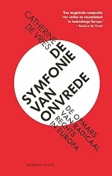

> "*Zoals we in Salland zouden zeggen: er mag best wat gekakeld worden, zolang we ook samen zorgen dat er weer eieren worden gelegd.*”\
> - Catherine de Vries

 

“Waarom betaal ik nog belasting en houd ik me aan de regels als ik er toch niets voor terugkrijg?” en “Zakkenvullers, daar in Den Haag”, dat is wat de vader van Catherine de Vries op een gegeven moment over de politiek in Nederland zei. In de tachtiger jaren was hij door bezuinigingen en ook nieuwe regels uit Europa zijn boerderij aan de voet van de Lemelerberg kwijtgeraakt. Hij en generaties voor hem hadden daar geleefd en zich er thuis gevoeld. Maar nu voelde hij zich door de staat helemaal alleen gelaten. Noodgedwongen moest hij in ploegendienst werken en een paar jaar later kwam hij vanwege medische redenen nog in de zorg terecht. Toen was de afstand tot de politiek al heel groot geworden en was hij overgestapt van het CDA via Fortuin naar de partij van Wilders, ook om het CDA een lesje te leren. Hij was niet de enige, schrijft De Vries in dit prachtige boek: *De symfonie van onvrede. De opmars van radicaal rechts in Europa*. De Vries is ervan overtuigd dat alles wat er in de politiek is gebeurd de laatste jaren niet is te begrijpen zonder het verhaal van mensen zoals dat van haar vader. Wat haar vader wilde was erkenning als burger en niet vergeten worden als het erop aankomt. Zijn verhaal is het verhaal van wat er in Duitsland, Verenigd Koninkrijk, Italië, Frankrijk en Nederland zelf is gebeurd.    
	Ook voor ons eigen land, met z’n rijkdom, gezondheid en sociaal welzijn, is het toch eigenlijk vreemd dat er zoveel wantrouwen en gevoel van verlies is ontstaan. Hoe kan dat en wat is hier gebeurd? Na de Tweede Wereldoorlog is er Nederland een stevig netwerk van publieke voorzieningen opgebouwd, met goed openbaar vervoer, huisartsen en scholen en bibliotheken voor iedereen. Voor de belasting die mensen betaalden, kregen ze veel terug. Die publieke voorzieningen verschraalden in de jaren tachtig wanneer er minder geld voor is, de afstand ertoe toeneemt, de kwaliteit inboet, de toegankelijkheid minder wordt en de belangstelling vanuit de overheid hiervoor afneemt. Er wordt steeds minder geïnvesteerd in zorg, huisvesting, onderwijs en infrastructuur en er ontstaat materiële en morele ongelijkheid. Bepaalde groepen tellen minder mee en op hen wordt neergekeken. Er ontstaat onvrede en er worden andere politieke en ideologische keuzes gemaakt. Nabijheid, erkenning en bescherming maken plaats voor wat er nog hoogstnoodzakelijk is en wat geld oplevert. Burgers zelf worden consumenten en als ze de staat nodig hebben voor wat ook, is die nauwelijks te bereiken. ‘Het gevoel dat er zorg en aandacht is voor jou op de plek waar je woont en leeft, verdween uit het dagelijks leven’.  

 

In dat klimaat zijn er populistische partijen die wel raad weten met die onvrede. Zij hebben het over ‘wij tegen zij’ en bestempelen de migranten en de elite als zondebokken. Er komen politici die dit verhaal naar hun hand zetten en die er een eenvoudig verhaal met simpele oplossingen van maken. Het vertrouwen in de staat, instituties en politici brokkelt langzaam. Andere partijen en media normaliseren en versterken het treurige verhaal. Het wordt het verhaal van iedereen, dat gaat over verlies, achterstelling en onbehagen en over verbroken beloftes en geschonden verwachtingen. De gemeenschap als geheel lijdt eronder. Alles wat er tegelijkertijd gebeurt (zoals marktwerking, globalisering, vergrijzing en beleidskeuzen die worden gemaakt) wordt gereduceerd tot ‘wat van ons is nemen ze af’.    
In heel Europa is dit gebeurd en De Vries laat zien wat ze zelf heeft meegemaakt in Duitsland, Engeland, Italië, Frankrijk en Nederland. In die landen studeert en werkt ze als sociaal wetenschapper die empirisch onderzoek doet naar deze sociale ontwikkelingen. In Duitsland raakt ze in 1999 betrokken bij een onderzoek naar de sociale en politieke gevolgen van de Duitse eenwording gedurende de afgelopen tien jaar. In de jaren negentig was daar de nadruk op bezuinigen en budgetdiscipline komen te liggen. Economisch deed het land het goed maar de maatregelen had een hoge sociale prijs waar met name mensen uit het oosten een gevoel van verlies en achterstelling aan over hielden. Scholen, ziekenhuizen en treinstations worden gesloten in Saksen, Thüringen en Brandenburg en op het leven van de ‘Ossies’ wordt neergekeken. Modernisering en rationalisering wordt door de mensen zelf als afbraak ervaren. Het morele kader van ooit is er niet meer en mensen worden ontvankelijk voor de rechts-radicale en AfD verhalen die het verlies betekenis weten te geven. Zij voelen heel goed aan dat dat verlies meer existentieel dan economisch is.    
	De Vries gaat terug naar Nederland om onderzoek te doen en te promoveren op analyses van kiezersbestanden en wordt in 2012 hoogleraar in Oxford, Engeland. Daar hoort ze over huisartsen die niet te bereiken zijn en buslijnen die zijn geschrapt en dat het allemaal aan Brussel en de immigrant ligt. Hier is het vooral de National Health Service die niet meer werkt, de grote trots van het land met de zorg die iedereen geboden wordt als je het nodig hebt. Als die NHS hapert, hapert de staat. Zeker wanneer het een wereld van wachten, uitstellen en afzien wordt. Als die overheid niet levert, komen er politici die het geheel wel eens flink willen opschudden. Ondanks dat er sterk op lokale overheden en de NHS is bezuinigd, krijgt de EU de schuld. De falende politiek wordt zichtbaar bij de lege balie of de onbereikbare huisarts.   
	In Engeland was het haar behoorlijk benauwd geworden en ze vertrekt via Nederland naar Milaan (Italië). In Milaan en andere delen van Noord-Italië leef je nog wel in een roes van vooruitgang, maar in de zuidelijke delen van dat land groeide wel degelijk dat gevoel van stilstand dat haar zo bekend voorkomt. In Puglia bijvoorbeeld, waar een boombacterie miljoenen olijfbomen heeft vernietigd. De olijfboom die een zo centrale plek inneemt in het dagelijkse leven hier, veranderde dat leven volledig. Daar in die zuidelijke omgeving van verlaten dorpen, ingeslapen stations, dode olijfbomen en de staat die nergens aanwezig is, wordt alles wel heel erg leeg.     
	In Frankrijk, waar ze in 2025 tijdelijk werkt ervaart ze hetzelfde waar met de grootschalige decentralisatie de afstand tot de politiek die steeds groter wordt en gemeenten die zelf met grote schulden blijven zitten. Er komt een tweedeling met rijke en dynamische stedelijke gebieden met hoogopgeleide burgers en de kleine steden en dorpen waar scholen, ziekenhuizen en treinverbindingen zijn gesloten.    
	En Nederland zelf is niets beter, met verhalen zoals die over haar vader, het toeslagenschandaal, het Groningse aardbevingsschadeschandaal en andere mensen die worden vermorzeld door de overheid. Hier is er een neoliberale wind gaan waaien met een marktlogica gericht op concurrentie, efficiëntie en meetbare resultaten. Alles wordt technocratischer en complexer, met een overheid die meer rekent dan luistert. Ook hier zie je dat de onvrede wordt vertaald in culturele vijandigheid en dat de migrant en de elite daar de schuld van krijgen. Hier kenmerkt zich het publieke debat in een afgenomen vertrouwen en een toegenomen verontwaardiging en wantrouwen.   

 

Het politieke verhaal heeft een andere grondtoon nodig en moet weer redelijk, betrouwbaar en menselijk worden. Daar is De Vries van overtuigd. In ieder geval is er een overheid nodig die zich concentreert op wat het doet en weer deel gaat uitmaken van het dagelijks leven van mensen. Een overheid die zichtbaar is, die de menselijke maat hanteert en weer structureel investeert in de publieke infrastructuur. Een andere overheid die nabij en persoonlijk is en dat als structurele voorwaarde ziet. Meebewegen met rechtse politiek, zoals te lang is gebeurd, werkt niet. Er is een alternatieve aanpak nodig met een passende logica. Een meerjarige agenda ook met duidelijke prioriteiten, met mensen die duidelijk kunnen maken waarom bepaalde keuzes worden gemaakt. Met een betere uitvoering ook, snellere loketten en strakkere regie. Deze nieuwe politiek vraagt verbeelding, een vermogen om je een andere toekomst voor te stellen, die inspireert en richting geeft. Democratische vitaliteit veronderstelt dat. Die nieuwe politiek begrijpt de ervaringen van mensen en geeft er betekenis aan. In ieder geval heeft die nieuwe politiek de moed om de nabijheid terug te brengen en weet ze waardigheid en erkenning van burgerschap te herstellen.     
Politici weten dus keuzes te maken, deze uit te leggen en het simpel te houden. Maar die nieuwe politiek is niet alleen het verhaal van deze politici. Ook anderen hebben hun gewoonten aan te passen. Bestuurders bijvoorbeeld denken niet in eerste instantie aan de opbouw van ingewikkelde systemen, maar zorgen ervoor dat in de uitvoering van beleid meer nabijheid komt te zitten. De ambtenaren voeren niet alleen opdrachten uit, maar krijgen weer ruimte en weten die waardig te gebruiken. De media op hun beurt verleggen de aandacht van het conflict naar het werk wat gedaan moet worden. Burgers zelf eisen van de politiek niet meer grote beloftes maar beoordelen haar op afgeronde resultaten. En iedereen weet dat politiek mensenwerk is en dat waardigheid en erkenning daar het fundament van is.    
De Vries heeft aansprekende ideeën over de politiek en bij haar gaat het over de organisatie van het sociale. Zij laat overtuigend zien dat dit een belangrijk aspect is om populisme tegen te gaan. Ook met haar vergelijkende studies tussen gebieden in diverse Europese waar kil wordt bezuinigd op de publieke infrastructuur in vergelijking met gebieden waar minder bezuinigd wordt of minder kil, laat ze zien dat dit terug te vinden in het stemgedrag van burgers. Uitkleden van de publieke infrastructuur zorgt voor meer radicaal rechts stemmen, analyses laten dat zien. In haar boek maakt ze op deze manier als geen ander duidelijk dat gericht investeren in het welzijn van mensen zo belangrijk is voor politiek succes. Of de hele politiek nu die van nabijheid, erkenning en waardigheid moet zijn is de vraag. Politiek heeft er ook voor te zorgen dat mensen zelf kunnen nadenken. Die weet ook de belangen van het geheel te verdedigen tegen landen die erop uit zijn om chaos te creëren of die weet antwoorden te vinden voor bedreigingen van het milieu. Daarover gaat De Vries’ boek niet. Op het sociale gebied is haar pleidooi heel overtuigend en allicht het beste politieke boek van de laatste tijd. Haar nuchtere vader zal zeker trots op haar zijn als hij in het hiernamaals een exemplaar van dit nieuwe boek te pakken krijgt.    

 

Vries, C. de (2026). *De symfonie van onvrede. De opmars van radicaal rechts in Europa*. Amsterdam/Antwerpen: Atlas Contact. 283 pagina’s

