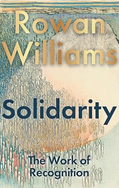

> "*Onze overeenstemming met dit patroon — een overeenstemming die nadrukkelijk geen aanpassing is aan een van buitenaf opgelegde norm, maar het uitleven van wat fundamenteel is voor de aard van onze zelfvorming — dát is waaruit het morele leven bestaat, datgene waartoe het ‘geweten’ ons richt, een structuur van actieve trouw aan de waarheid en daarmee aan het algemeen welzijn.”*”\
> - -	Rowan Williams

 

Rowan Williams is een Britse theoloog en dichter van 2002 tot 2012 was hij aartsbisschop van Canterbury. Hij staat bekend om zijn diepzinnige boeken, niet zelden in een complexe stijl geschreven. In die boeken laat hij geloof, spiritualiteit, literatuur en samenleving samenkomen. Onlangs schreef hij zijn doorwrochte boek *Solidarity: The Work of Recognition*, dat gaat over het moeilijke begrip solidariteit. Hij heeft er jarenlang aan gewerkt. Hij kwam het halverwege de jaren tachtig tegen toen hij met zijn vrouw enkele maanden voor de Anglikaanse kerk werkte in Zuid-Afrika. Toen maakte hij kennis met het Ubuntu, de Afrikaanse vorm van humunisme, waarin het samenleven met elkaar belangrijk is, zo anders is dan het Europese en Amerikaanse idee van vrijheid en individuele waardigheid. Vanaf dat moment begon hij na te denken over de betekenis van solidariteit en wat het eigenlijk betekent. Op heel veel plekken in de wereld heeft hij er de afgelopen jaren lezingen en seminars over gehouden en met dit boek heeft hij daar een geheel van gemaakt.    
Williams wil het begrip solidariteit opnieuw doordenken en eraan bijdragen dat het meer wordt gerealiseerd. In zijn zoektocht gebruikt hij allerlei bronnen uit culturele, intellectuele en religieuze contexten en betrekt daar filosofie (mn de fenomenologische filosofie), culturele en politieke theorie, literatuur en, natuurlijk wat hem betreft, theologie bij.      

 

Williams komt het woord solidariteit steeds en overal op de wereld tegen. Het woord wordt op verschillende manieren gebruikt en het roept allerlei vragen op. In zijn boek Solidarity heeft hij het over solidariteit met de ‘ander’, wat deze solidariteit zo moeilijk maakt en waarom het eigenlijk ingewikkeld is. Solidariteit heeft te maken met dat voortdurende werk van erkenning en jezelf bevragen te maken. Het gaat over lezen en gelezen worden en dat is voor Williams een wederkerig proces van erkenning. Daarin spelen allerlei krachten mee die het ons moeilijk maken om goed met ‘de ander’ om te gaan en solidair te kunnen zijn. Er zijn ook redenen om daar sceptisch over te zijn en dan hoef je alleen maar aan uitdagingen te denken zoals AI. Voor Williams staat het vast dat de erkenning van ‘de ander’ werk is dat je serieus en waar je de tijd voor moet nemen. Er komt nogal wat bij kijken wil solidariteit werkelijk worden. 
Op basis van een studie van een aantal denkers bouwt hij zijn theorie over solidariteit verder uit. Hun werk is gevormd in nationale en persoonlijke geschiedenissen die in hun denken over solidariteit steeds weer opduiken. De Tsjech Jan Patočka (1907-1977) studeerde bij Husserl en Heidegger en heeft de bezetting van de Duitsers eerst en vervolgens de Russen daarna meegemaakt. Hij voelde zich Europeaan en de zorg van de ziel is ondanks alles wat volgens hem bij Europa past. Daarvoor wilde Patočka de politieke macht en morele doelen opnieuw doordenken. Zijn filosofie gaat over vrijheid, verantwoordelijkheid en de geestelijke crisis van de moderne wereld. Hij werd internationaal bekend door zijn idee van de ‘solidariteit van de geschokten’, de solidariteit van mensen die door oorlog, lijden en historische crises tot een dieper bewustzijn komen.    
De Pool Józef Tischner (1931-2000) was een Pools filosoof, katholiek priester die in de jaren tachtig van de vorige eeuw tot de denkers van de Poolse Solidarność-beweging behoorde. In zijn denken over solidariteit benadrukte Tischner dat echte solidariteit niet gebouwd mag zijn op haat of op het creëren van vijanden. ‘Solidariteit zonder vijanden’ ontstaat volgens Tischner uit wederzijdse erkenning, morele verantwoordelijkheid en de waardigheid van iedere mens. Solidariteit ziet hij niet als een ideologische strijd om anderen uit te sluiten. Voor Tischner gaat het bij solidariteit om een gemeenschappelijk zoeken naar waarheid en rechtvaardigheid. Werkelijke solidariteit vraagt dialoog, gewetensvorming en bereidheid om ook de ander als mens te blijven zien, zelfs in conflict en politieke strijd.     
Dietrich Bonhoeffer (1906-1945) was een Duitse theoloog, predikant en verzetsstrijder tegen het nationaalsocialisme. Bonhoeffer voelt zich betrokken bij menselijke nood en onrecht. Hij sprak over ‘plaatsvervangend handelen’, leven voor en met anderen. Hij verzette hij zich actief tegen Hitler en de vervolging van Joden, ook toen dit zijn eigen leven in gevaar bracht. Solidariteit vraagt volgens Bonhoeffer moed, trouw en bereidheid schuld en risico’s te dragen in dienst van menselijke waardigheid.    
Dan is er ook nog Charles Williams (1886-1945) een Britse dichter, romanschrijver, literair criticus en christelijk denker. Vooral met hem voelt Rowan Williams zich verwant. C. Williams begrip van solidariteit draait om ‘wederzijdse verbondenheid’, waarbij het gaat het om het diepe en wederzijds verbonden-zijn van mensen. Daarin staat niemand volledig op zichzelf (‘Jouw leven en jouw dood zijn met je naaste’). Mensen dragen volgens deze Williams elkaars lasten, schuld, vreugde en verantwoordelijkheid. Liefde betekent bereidheid om plaatsvervangend voor anderen te handelen en hun nood mede te dragen. Solidariteit is bij hem sociaal of politiek, maar ook spiritueel en mystiek. C. Williams wordt R. Williams belangrijkste gids in een visie op solidariteit die ‘zich opent naar communio … die een wederkerige betrokkenheid en, mogelijk, verrijking ontsluit, waarin geen van beide subjecten onveranderd blijft en waarin ieder een geschiedenis verwerft waarin de ander constitutief is’. De ‘solidariteit tot communio’, zeg maar. 
Het begrip solidariteit dat Williams in zijn boek Solidarity verdedigt is niet meer iets dat als een onveranderd en vaststaand zelfbegrip aan een ander wordt aanboden. Dat vraagt nogal wat van mensen.    

 

Op het moment dat Williams boek uitkomt, verschijnt ook *Solidariteit. Een kleine filosofie* van René ten Bos. Ook Bos schrijft dat het woord solidariteit te pas en te onpas gebruikt wordt tegenwoordig. De betekenis ervan kennen we eigenlijk helemaal niet. Zodra we er betekenis aan geven (natuurlijk, het heeft iets met verbintenis te maken), glipt het door onze handen en verliest het glans. En als we het toch proberen, heeft het uiteindelijk vaak met de hoe-vraag te maken, zoiets als: iedereen moet zijn of haar steente bijdragen. Op de vraag waarom solidariteit zo belangrijk is, daar gaat het natuurlijk om, blijven we stil. Dat is wat Bos duidelijk wil maken. Dat we eigenlijk met z’n allen blind zijn geworden om verbindingen aan te gaan met mensen die we niet kennen of waar we niets van weten. Dat het goed is om meer gemeenschappe-lijkheid te creëren en om diepere, stabielere en eerlijkere vormen van solidariteit aan te gaan. Solidariteit eerst maar eens zoeken in kleinere, alledaagse gestes en vluchtige solidariteit als een groet, een handdruk, een compliment, een uitnodiging of een grap. Zelfs dit durft Bos nauwelijks echt uit te spreken omdat hij weet dat het er op dit moment niet de wereld naar is; er zijn genoeg mensen die dit, om welke reden dan ook, onderuit zullen halen. Bos laat ons in vertwijfeling achter.    
	Hier is Williams niet bang voor en ook niet om aan te geven waarom solidariteit belangrijk is. Rowan Williams beschrijft solidariteit als iets dat veel verder gaat dan medelijden of morele steun aan slachtoffers. Het is iets anders dan empathie, als moderne allesoplossende houding, zoals we die vaak tegemoetkomen bij mensen met de behoeften van ‘een luidruchtig zelf’ die ‘het idee van een werkelijke vreemde niet kan verdragen’. Ware solidariteit is volgens Williams niet zozeer een deugd die gecultiveerd moet worden en ook meer dan een menselijke conditie die erkend moet worden. Williams wil verder gaan dan het idee van mensenrechten, die door hem als op zichzelf staande individuele aanspraken worden gezien of ‘cheques die geïnd moeten worden’. Daardoor kunnen die rechten gemakkelijk veranderen in ‘botsende absolutismen’. De verhitte en eindeloze discussies over de vrijheid van meningsuiting zijn daar een voorbeeld van.     
De morele onderlinge afhankelijkheid van al het menselijke leven (daar gaat het hem om) vereist een voortdurende dialoog waarin rechten samengaan met verplichtingen. Solidariteit die hij voor ogen heeft ontstaat uit het besef dat mensen fundamenteel afhankelijk zijn van elkaar en ze elkaars kwetsbaarheid delen. Wat een ander bedreigt, raakt ook onszelf. Solidariteit dus niet als een oppervlakkig gevoel, maar als een actieve houding van samenwerking, wederzijdse erkenning en gezamenlijke verantwoordelijkheid. Mensen bestaan niet als volledig autonome individuen. Hun identiteit wordt gevormd in relaties met anderen, via taal, arbeid, communicatie en gedeelde ervaringen. Het gaat erom dat mensen serieus worden genomen als betekenisvolle deelnemer aan een gemeenschappelijke wereld. Daarom is solidariteit zo belangrijk.    
Solidariteit ziet Williams terecht als een kernvoorwaarde van een rechtvaardige samenleving en een correctie op het pure individualisme. Daarbij kunnen we leren van mensen als Patočka, Tischner, Bonhoeffer en C. Williams. Jan Patočka die verwijst naar mensen die door oorlog en ontwrichting heen een dieper besef van verbondenheid ontwikkelen. Bij Józef Tischner staat gezamenlijke arbeid centraal en solidariteit die groeit in samenwerken, waarheid spreken en elkaars lasten dragen. Dietrich Bonhoeffer verbindt solidariteit met verantwoordelijkheid voor de kwetsbaarheid van anderen, ook wanneer dit morele onzekerheid en risico’s met zich meebrengt. Volgens Charles Williams, ten slotte, vraagt solidariteit tijd, oefening en geduld. Solidariteit ontstaat door een langdurig proces van luisteren, leren en wederzijdse correctie. Dat is inspanning, dat is arbeid.     
In onze moderne samenleving wordt deze arbeid vaak gereduceerd tot technische en bureaucratische taken en verandert soldiariteit in simplistische identiteitspolitiek van ‘wij tegen zij’, waar het zou moeten gaan om samenwerking als een open proces van communicatie en gedeelde verantwoordelijkheid. De klimaatcrisis en de coronapandemie laten volgens Rowan Williams zien hoe diep mensen al met elkaar verbonden zijn. Niemand blijft veilig wanneer anderen onveilig zijn. Bij solidariteit gaat het niet alleen om de mensen onderling, maar ook om de bredere wereld waarvan alle mensen afhankelijk zijn. Daarom is het ook nodig dat we niet langer onszelf zien als afgesloten individuen, dat we verbonden zijn met anderen en pas werkelijk mens worden in gemeenschap met anderen. Solidariteit betekent niet dat de verschillen tussen mensen verdwijnen, maar dat ze juist leren samen te leven mét verschil, afstand en wederzijdse afhankelijkheid.     
*Solidarity: The Work of Recognition* is geen gemakkelijk boek en soms vraag je jezelf af of je het wel helemaal goed begrijpt. Het is een boek dat je soms opnieuw moet pakken om bepaalde delen nog eens te lezen. Het is ook een christelijk boek waar ik, met excuses, omheen lees. Maar het is een boek dat ons op een orginele manier naar de wereld en de mens laat kijken. Een boek dat ons van harte uitnodigt om van solidariteit werk te maken. 

 

Bos, R. ten Bos (2026). *Solidariteit. Een kleine filosofie*. Amsterdam: Boom. 159 pagina’s

Williams, R. (2026). *Solidarity: The Work of Recognition*. London: Bloomsbury Continuum. 320 pagina’s 

