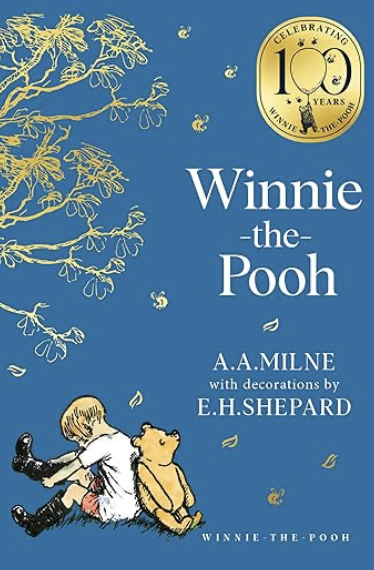

> "*“Soms nemen de kleinste dingen de meeste plaats in je hart in.”*\
> - Winnie-de-Poeh

 

Winnie-de-Poeh is natuurlijk een van de grote figuren uit de wereldkinderliteratuur. Het boek verscheen honderd jaar geleden. Sinds zijn eerste optreden in 1926 heeft deze vriendelijke beer generaties lezers geïnspireerd. Het boek *Winnie-the-Pooh* van A.A. Milne lijkt op het eerste gezicht een eenvoudige verzameling verhalen over pratende dieren in een bos. De verhalen spelen zich af in het Honderd Bunderbos, een fictieve omgeving die is gebaseerd op Ashdown Forest in het Engelse Sussex. In dat stukje bos beleven Winnie-de-Poeh en zijn vrienden allerlei kleine avonturen die samen een tijdloos beeld schetsen van het kinderlijk bestaan. Maar achter deze ogenschijnlijke eenvoud gaat een rijke wereld schuil van vriendschap, verbeelding, humor en levenswijsheid.   
  Het boek kwam voort uit de relatie die A.A. Milne had met zijn zoon Christopher Robin. Vader vertelde zijn zoon deze verhalen aanvankelijk als bedtijdverhalen en de knuffeldieren van Christopher Robin zelf speelden daarin de hoofdrol. In het boek zelf leeft Christopher Robin tussen de dieren leeft, veelal in de rol van een rustige en verstandige gids. De verhalen zelf zoeken voortdurend de grens op tussen werkelijkheid en fantasie. De lezer weet dat het om poppen en speelgoed gaat die tot leven komen in de verbeelding van een kind. Binnen de verhalen in het Honderd Bunderbos zijn de dieren volwaardige personen met hun eigen karakter, zorgen en verlangens. Wie zijn het ook al weer en waar gaat het boek over?
  
   

Winnie-de-Poeh zelf staat centraal in vrijwel alle verhalen. Hij noemt zichzelf een beer met een ‘heel klein verstand’. Zijn bescheidenheid maakt hem sympathiek. Poeh is niet bijzonder slim, niet georganiseerd, noch moedig. Hij is wel, wat je zou kunnen zeggen, goed. Hij lijkt in geen enkele situatie achterdocht te kennen en stapt voortdurend met groot vertrouwen op zijn vrienden af. Hij kent een zwakke kant, zijn liefde voor honing en die vormt de aanleiding voor allerlei komische situaties. “Toen dacht hij opnieuw een hele poos na en zei: ‘En de enige reden waarom een bij bestaat, voor zover ik weet, is het maken van honing.’ Toen stond hij op en zei: ‘En de enige reden om honing te maken is zodat ik hem kan opeten.’ Daarop begon hij in de boom te klimmen.” Zo probeert hij honing te stelen uit een bijennest door zich als een donkere regenwolk te vermommen en aan een blauwe ballon omhoog te zweven. Dat plan mislukt natuurlijk volledig, de manier echter waarop Poeh zijn gekke idee uitvoert, maakt het verhaal humoristisch en vermakelijk.    
  De verhalen in het boek zijn allemaal verhalen over misverstanden en vergissingen en laten de botsing zien tussen kinderlijke logica en de werkelijkheid, zoals in het verhaal waarin Poeh op bezoek gaat bij Konijn. Nadat hij zich te goed heeft gedaan aan honing en andere lekkernijen, blijkt hij zo dik geworden dat hij vast komt te zitten in de voordeur van zijn gastheer. *“Poeh Beer stak een poot naar buiten en Konijn trok en trok en trok...‘Au!’ riep Poeh. ‘Je doet me zeer!’ ‘Het punt is,’ zei Konijn, ‘dat je klem zit.’ ‘Dat komt er nou van,’ zei Poeh geërgerd, ‘als voordeuren niet groot genoeg zijn.’ ‘Dat komt er nou van,’ zei Konijn streng, ‘als je te veel eet. Ik dacht het toen al,’ zei Konijn, ‘maar ik wilde er niets van zeggen,’ zei Konijn, ‘dat...’”* Een week lang zit Poeh letterlijk opgesloten in het huis van Konijn, totdat hij voldoende is afgevallen om weer losgetrokken te worden. De situatie is absurd, maar tegelijkertijd volkomen geloofwaardig binnen de wereld van het Honderd Bunderbos.     
  Naast Poeh speelt Knorretje een belangrijke rol in de verhalen. Hij is klein, onzeker en vaak bang. Toch blijkt hij telkens weer over onverwachte moed te beschikken wanneer zijn vrienden hem nodig hebben. Samen beleven Poeh en Knorretje avonturen die vaak beginnen met een eenvoudig idee en monden uit in verwarring of ontdekking. Wanneer Poeh en Knorretje bijvoorbeeld sporen in de sneeuw volgen, raken zij ervan overtuigd dat zij een gevaarlijk wezen op het spoor zijn. Pas later beseffen zij dat zij al die tijd hun eigen voetstappen hebben gevolgd. Het verhaal laat niet alleen zien hoe gemakkelijk verbeelding op werkelijkheid lijkt en ook hoe vriendschap angst draaglijk maakt.    
  Een ander geliefd figuur is Iejoor, de sombere ezel. Hij verwacht altijd het ergste en ziet in elke gebeurtenis een reden tot pessimisme. Toch wordt hij door niemand afgewezen. Zijn vrienden accepteren hem zoals hij is. Dat blijkt uit het verhaal over zijn verjaardag. Poeh wil hem een pot honing geven, maar eet onderweg de inhoud op. Knorretje heeft een mooie ballon gekocht, maar laat die per ongeluk knappen. Uiteindelijk krijgt Iejoor een lege honingpot van Poeh en een kapotte ballon van Knoretje. Maar uiteindelijk ziet Iejoor dat hij, heel handig, een pot krijgt waar hij dingen in kan stoppen en uit kan halen. *“Maar Iejoor luisterde niet. Hij haalde de ballon eruit en stopte hem er weer in, zo gelukkig als hij maar kon zijn...”* In plaats van teleurgesteld te zijn, is hij oprecht blij en het verhaal combineert hiermee humor met een ontroerende boodschap, en wel dat goede bedoelingen belangrijker zijn dan de geschenken zelf.    
  De bewoners van het bos hebben uitgesproken persoonlijkheden. Uil beschouwt zichzelf als een groot geleerde, hoewel hij woorden vaak verkeerd spelt en zijn kennis beperkt is. Konijn organiseert graag alles en iedereen en is ervan overtuigd dat hij de beste oplossingen kent. Kanga brengt een moederlijke warmte in de gemeenschap, terwijl haar zoon Roe speelsheid en nieuwsgierigheid vertegenwoordigt. Samen vormen de dieren een kleine samenleving die een Grote Gemeenschap is waarin verschillen niet worden weggewerkt en juist worden gewaardeerd.    
  Een aantal thema’s komen in het verhaal terug. Een van de belangrijkste thema’s van het boek is vriendschap. De bewoners van het Honderd Bunderbos zijn van elkaar afhankelijk. Wanneer iemand hulp nodig heeft, staan de anderen klaar. Tijdens een overstroming gebruikt Poeh zijn inventiviteit om Knorretje te redden. Wanneer Iejoor zijn staart verliest, zetten zijn vrienden alles op alles om die terug te vinden. De dieren zijn er voor elkaar. De verhalen laten zien dat een gemeenschap er niet is omdat iedereen hetzelfde is, maar juist doordat ze elkaar accepteren en ondersteunen en de verschillen het geheel sterker maken. Een ander thema is verbeelding. Het hele boek is doordrenkt van de fantasie van een kind. Expedities, monsters en grote ontdekkingen blijken vaak gewone gebeurtenissen te zijn die door de ogen van kinderen een bijzondere betekenis krijgen. Zo ondernemen Christopher Robin en zijn vrienden een ‘expeditie’ om de Noordpool te ontdekken, terwijl zij in werkelijkheid slechts een wandeling maken. Toch voelt de onderneming voor hen als een groot avontuur. Milne laat zien dat de verbeelding geen vlucht uit de werkelijkheid is, maar een manier om de wereld rijker en betekenisvoller te maken. Tot slot zit het verhaal vol humor en levenswijsheid. Geen enkel personage is ideaal. Poeh is vergeetachtig, Knorretje angstig, Iejoor somber, Uil ijdel en Konijn bazig. Die tekortkomingen worden nooit gezien als fouten die moeten worden gecorrigeerd. Integendeel, zij maken deel uit van de eigenheid van elk personage individueel en van de Grote Gemeenschap als geheel. Het Honderd Bunderbos is een gemeenschap waarin niemand hoeft te bewijzen dat hij slim, sterk of succesvol is om erbij te horen en dat ze elkaar nodig hebben om die prachtige gemeenschap te vormen.   

 

*Winnie-the-Poeh* biedt een wereld waarin vriendelijkheid belangrijker is dan prestaties en waar avontuur bestaat uit kleine gebeurtenissen van alledag. De verhalen herinneren de lezer eraan dat geluk vaak schuilt in eenvoudige dingen, een wandeling met een vriend, een gesprek onder een boom, een gedeelde maaltijd of de wetenschap dat iemand aan je denkt. Een eeuw na zijn verschijnen blijft Winnie-the-Pooh daarom meer dan een kinderboek. Het is een ode aan vriendschap, verbeelding en menselijke verbondenheid. Het is een ode aan de Grote Gemeenschap. Achter de humor en de speelse avonturen schuilt een wijsheid die zowel kinderen als volwassenen aanspreekt. In de rustige wereld van het Honderd Bunderbos vinden lezers een herinnering aan wat werkelijk van waarde is: aandacht voor elkaar, ruimte voor verschillen en het vermogen om met verwondering naar elkaar en de wereld te blijven kijken. In Winnie-the-Poeh draait alles om vriendschap, kleine zorgen oplossen en een overzichtelijke gemeenschap. De dieren in het Honderd Bunderbos hebben hun eigenaardigheden: Misverstanden worden opgelost door geduld, humor en wederzijdse acceptatie. Niemand probeert de ander te domineren.      
Die tijdloze wereld van deze Grote Gemeenschap is heel anders dan de Grote Samenleving van tegenwoordig met onze roodharige zelfbenoemde hoofdpersoon, die niet alleen het leven in zijn eigen bos onaangenaam maakt maar ook het leven in andere bossen. Vriendschap, verbeelding en verbondenheid hebben er plaatsgemaakt voor haat, rancune en angst.  Aan het begin van Milne’s boek moest ik denk: *“HIER KOMT EDWARD BEER, die nu de trap afdaalt: bonk, bonk, bonk, op zijn achterhoofd, achter Christopher Robin aan. Voor zover hij weet, is dit de enige manier om van een trap af te komen. Maar soms denkt hij dat er vast nog een andere manier bestaat, als hij maar even kon ophouden met bonken om daarover na te denken. En dan denkt hij weer dat die andere manier misschien helemaal niet bestaat. Hoe dan ook, hij is nu beneden en klaar om aan u voorgesteld te worden. Winnie de Poeh.”* Dat klinkt toch wel heel anders dan de roodharige hoofdpersoon die op 27 maart over Iran zei: *“Je moet het zien. Het is ontzettend gaaf. Raketten die worden afgevuurd, raketten die worden afgevuurd, raketten die worden afgevuurd. Ze blijven maar afgaan … En dan, na zeven seconden: vuur, vuur, vuur. Het meest ongelooflijke dat je je kunt voorstellen. Vuur, boem, vuur, boem.”*

 

Millne, A.A. with decorations by E.H. Shepard (2025/1926). *Winnie-the-Poeh*. Dublin: HarperCollinsPublishers

