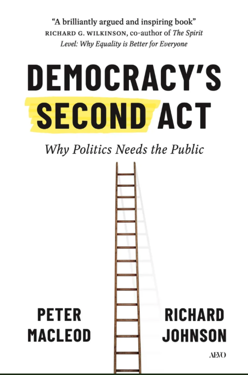

> "*“Als we willen dat de democratie overleeft, moeten we beginnen met anders over het publiek te denken. En daar ook naar handelen. De verworvenheden van de moderne democratieën verdienen het om gevierd te worden, maar we kunnen niet doen alsof zij de volledige en definitieve verwezenlijking van ons democratische potentieel vormen. Zij zijn slechts [het eerste bedrijf]{.underline}."*\
> - MacLeod en Johnson

 

MacLeod and Johnson beginnen hun *Democracy’s second act: why politics needs the public* heel treffend in de strafrechtbank van Manhattan (New York). Terwijl rechters daar rondlopen in hun fraaie gewaden en advocaten met hun dure schoenen, zitten er elke dag honderden gewone Newyorkers als mogelijke juryleden te wachten op hun juryrol. Zij worden voor een klein bedrag per uur betaald om een publieke rol te vervullen in openbare rechtspraak van dit oude instituut van democratie. Zij doen hier nog steeds graag aan mee en dragen bij aan het algemeen belang. Hier zit meteen ook al de kern in van de boodschap die de twee Canadesen (MacLeod en Johnson)met hun boek willen uitdragen, dat democratie het delen van macht met elkaar is, waar publieken bijhoren en waar mensen met elkaar hun capaciteiten gebruiken om problemen op te lossen.

Democratie heeft haar eerste zeer succesvolle fase gehad, die zich vooral voltrok rondom het stemrecht voor iedere burger. Dat simpele stemmen van vertegenwoordigers was een belangrijke mijlpaal voor de democratie. Aan dat recht zijn eeuwen van strijd vooraf gegaan en dat recht staat nog steeds onder druk. Tegelijk beseffen we ook dat democratie niet alleen verdedigd moet worden, dat beseffen we maar al te goed, het heeft ook een nieuwe fase nodig om verder te komen. Hier gaat het over de rol die mensen met elkaar kunnen spelen op allerlei plekken in gemeenschappen en buurten, op het werk en het lokale, provinciale en nationale niveau. Het gaat over de capaciteiten die mensen hebben en die erbij nodig zijn. En het gaat ook over de voorwaarden waarop die publieken worden geïnformeerd, betrokken en productief gemaakt. Politiek heeft publieken nodig om aan te tonen dat mensen niet apatisch, dom of alleen maar op eigen belang gericht zijn. In die publieken wordt getoond dat mensen wel degelijk solidair, verbeeldend en voor anderen kunnen zorgen. Daar kunnen mensen voorbij hun eigen belang komen en hun wederkerigheid tonen.

Een revival van de democratie is nodig nu mensen zoveel vertrouwen in de politiek en hun vertegenwoordigers zijn verloren. Ook al is dat verlies van vertrouwen van mensen in de politiek alarmerend, een veel groter probleem is allicht dat de politiek zelf het vertrouwen in mensen is kwijtgeraakt. We verwachten misschien wel te weinig van mensen in plaats van teveel. Gezonde democratieën hebben gezonde publieken nodig, plaatsen waar mensen zich thuisvoelen, waar ze hun eigen belang terzijde kunnen schuiven en waar ze goed geïnformeerd en in gelijke posities met elkaar naar het algemene belang kunnen kijken en oplossingen voor problemen kunnen vinden. Mensen hebben platforms nodig om samen te werken. Democratie is de praktijk ervan. In die publieke ruimtes vinden mensen redenen om samen te werken en mogelijkheden om met elkaar ideeën te vormen en daar ontwikkelen ze kennis en capaciteiten.

 

Democratie van het tweede bedrijf of deliberatieve democratie is niet iets onbekends. MacLeods en Johnson geven ons in hun boek een groot aantal voorbeelden. Ze beginnen met de storm van 13 december 1287 in Friesland die tienduizenden het leven kostte. Het was duidelijk dat bouwen op terpen niet voldoende was om waternoodrampen te overleven en dat mensen op een andere manier tegen land en zee moesten gaan aankijken. Er kwam een nieuw systeem van kanalen, dijken en landwinning. Bovendien onstonden waterschappen, nieuwe publieken waarin het ging om het belang van hele gemeenschappen, gedeelde waarden, gemeenschappelijke interessen, dialoog, compromis en samen beslissingen nemen. Het verhaal van de Nederlandse waterschappen is het verhaal van democratie in basisvorm. Ook in de recente geschiedenis vinden MacLeod en Johnson een goed voorbeeld. In Ierland was er vijftien jaar geleden een groot gebrek aan vertrouwen in de overheid en al heel lang behoefte aan politieke hervorming. Op basis van Canadese voorbeeld kwam er een Ierse volksvertegenwoordiging van 99 burgervertegenwoordigers die met elkaar over de grondwet gingen praten. Hun werk leidde niet alleen tot een referendum over het homohuwelijk, maar ook over abortus. Ierland had te maken met ‘een stille revolutie’ en dit liet zien hoe een betrekkelijke kleine groep van burgers met elkaar een bron van democratie kunnen vormen en kunnen bijdragen aan de ontwikkelingen in een land.

Een steeds belangrijker onderdeel van publieke opinie in een vertegenwoordigende democratie is de peiling geworden waarmee de mening van de burger op een eenvoudige manier gemeten wordt. De beperking daarvan wordt steeds meer ingezien. Peilingen ondermijnen de democratie steeds meer en ze worden eerder een gereedschap om afwijkende meningen mee te onderdrukken en verschillen tussen groepen uit te buiten. In de democratieën van tegenwoordig loopt de vrije pers ook steeds meer gevaar omdat de nieuwsgaring in handen is van een kleine groep hele rijke mensen en bedrijven die minder op hebben met het algemeen belang dan met het eigen belang. En dan is er nog de manier waarop jongeren via sociale media worden benaderd en die steeds meer kritiek oproept.

Daarom is het goed dat er naar nieuwe manieren wordt gezocht om met burgers om te gaan. Het idee van deliberatieve democratie is daarbij niet altijd eenvoudig en succesvol. Maar dit soort initiatieven, om met elkaar problemen op te lossen door vertegenwoordigende groepen die naar het algemeen belang kijken, zijn er wereldwijd wel steeds vaker. In Frankrijk, Oostenrijk, Polen, Singapore, Wales, Schotland, Canada en België zijn er voorbeelden hiervan. Sinds 2019 zijn er meer dan negenhonderd van deze volksvertegenwoordigingen geweest in ten minste veertig landen. Het aantal bereidt steeds verder uit. Het succes hangt van voorwaarden af, zoals hoe zijn de burgers geselecteerd, wie vertegenwoordigen ze, hoe worden ze geïnformeerd en wat leren ze, hoe worden ze gefaciliteerd, hoe gebruiken ze hun kennis, hoe nemen ze beslissingen en wat wordt er met die beslissingen gedaan.

     MacLeod en Johnson gaan op zoek naar initiatieven die hierbij passen. Zo is er het digitale platform vTaiwan en Polis dat zorgt voor menselijke dialoog, gezamenlijk beslissingen nemen en een kracht voor creatieve politiek is geworden. Over hoe van het publiek is te leren is veel op te steken van wetenschappers als Rosling (Zweden), Suzuki (Canada) en Nye (Amerika), wetenschappers bij wie het om de liefde van kennis gaat en die respect voor het publiek uitstralen. Voor deliberatieve democratie is het ook belangrijk dat de monopolie van een kleine selecte groep op de media wordt doorbroken, er wordt geïnvesteerd in publieke ruimtes (zeker met lokaal nieuws) en gebruikers worden beschermd. Zoals dat ook bij andere infrastructuren heel normaal is. Een goed functionerende democratie is geen luxe. Democratie heeft een goede communicatie nodig tussen overheid, experts en burgers. Daarbij wordt, meer dan nu het geval is, van burgers geleerd en krijgen die burgers ook meer vertrouwen. Die burgers kunnen hier zelf initiatief toe nemen. MacLeod en Johnson geven spraakmakende voorbeelden, zoals het met elkaar verzamelen van kindertanden om de invloed van het oefenen met nucleaire wapens aan te tonen; de burgerinitiatieven in Canada om Syrische vluchtelingen op te vangen; het ‘stolperstein’-project in Duitsland om zichtbaar te maken waar Joden woonden voordat de Nazis kwamen. Initiatieven vanuit de burgers zelf. Van bovenaf kunnen associaties worden gevormd om met elkaar te leren, betrokken te zijn te zijn en algemeen belang en binding uit te drukken. Zoals dat gebeurt met al die associaties in Denemarken; met de duizenden ‘People’s Association’ in Singaporte; en via Community of Businesses-coöperatie in Ann Arbor. Het kleinere gemeenschapsinitiatieven kunnen de deliberatieve democratie uitdrukken, zoals de Community Conferencing Center in Baltimore om incidenten, criminaliteit en conflicten met elkaar op te lossen; of het Frontier College dat in Nova Scotia begon om immigranten te helpen bij hun integratie. De volksvertegenwoordigingen, de associaties, coöperaties en fesitivals om deze vorm van democratie te vieren zijn vormen om een volgende stap in democratie te zetten.

 

In het boek grijpen MacLeod en Johnson terug op een discussie die Lippmann en Dewey honderd jaar geleden met elkaar voerden in Amerika. Lippmann was tijdens de Eerste Wereldoorlog adviseur van de Amerikaanse president Wilson en zag in die jaren dat de publieke opinie een nieuwe vorm had gekregen. Hij schreef er twee boeken over. Mensen konden door de publieke opinie worden misleid en waren eigenlijk niet in staat om de politiek in al z’n complexiteit te volgen. Dat moesten we, volgens Lippmann, ook maar niet proberen. Beter was het dit aan experts over te laten zodat gewone mensen hun eigen ding konden doen, waaronder democratisch kiezen als het nodig was. Zo zou de democratie beter werken. Dewey wist dat het Lippmann ging om het versterken van democratie, maar ging zelf verder in zijn idee over democratie. Democratie kun je niet aan experts alleen over laten. Als je schoen problemen veroorzaakt, zo schreef hij in zijn eigen boek over dit onderwerp, ga je naar de schoenmaker. Maar alleen jij, schoenendrager, kunt het beste uitleggen waar het precies in de schoen knelt. En zo is dat in een democratie eigenlijk ook. Voor het oplossen van problemen zijn naast vertegenwoordigers en experts ook gewone mensen nodig. Lippmanns gedachten horen bij het klassieke eerste bedrijf van de democratie, Deweys ideeën horen bij het nieuwe tweede bedrijf. Het eerste bedrijf met z’n politieke vertegenwoordiging, vrije pers, onafhankelijk juridisch systeem en stemrecht voor iedereen moet nog steeds verdedigd worden. Dat is wel duidelijk geworden de laatste jaren. Maar in die periode zijn er ook nieuwe problemen bij gekomen. Die raken vooral het publieke informatiesysteem met de nieuwe plaforms van sociale media, misinformatie en polarisatie. Die problemen vragen nieuwe antwoorden, zoals de hele nieuwe sociale situatie om invloed van meer mensen vraagt. Het vraagt meer publieken om met elkaar te overleggen, beslissingen te nemen en problemen op te lossen. Dit zal de democratie sterker, gedeelder en levendiger maken. Hier ligt ook de opdracht voor democratische instituten om publieken beter geinformeerd, betrokken en productiever te maken. En de politiek heeft de taak de representatie meer te delen en er voor te zorgen dat mensen er toe doen, gehoord worden en meetellen. Niet op een populistische, maar op een democratische manier.

     *Democracy’s second act: why politics needs the public* is een zeer uitdagend en inspirerend boek. Het is goed als democraten niet alleen maar in de verdediging zitten maar ook met nieuwe perspectieven komen waar mensen zich aan kunnen optrekken. Het democratisch potentieel is veel rijker dan we soms denken. In ieder geval bieden MacLeod en Johnson met hun boek veel stof om verder met elkaar over na te denken en te spreken. Na het lezen blijf ik wel met de vraag zitten of deze vorm van ‘democratie plus’ overal een antwoord op is. Of en hoe je dat doet voor wereldwijde problematieken rondom oorlog en vrede, klimaat en internationaal recht blijft voor mij onduidelijk. Maar het boek geeft richting, wil ons begrip van democratie oprekken en is ook nog mooi geschreven. Lezen, zou ik zeggen.

 

MacLeod, P and Johnson, R. (1926). *Democracy’s second act: why politics needs the public.* Toronto: University of Toronto Press.

