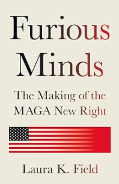

*In het damestoilet van de Colonnade Club herinner ik me dat ik in de spiegel keek. Zelfs op dat moment voelde het allemaal onwerkelijk, bijna filmisch. Ik schudde mijn hoofd en dacht: ‘Wat een ongelooflijke klootzak.’ Vervolgens vroeg ik mezelf af: ‘Wat doe ik hier in hemelsnaam?’ Dat was het begin van het lange, langzame proces waarin ik me losmaakte uit de wereld van het conservatieve intellectuele denken. Mijn timing was goed.”*\
> - Laura Field

 

Laura Field onderzoekt in *Furious Minds: The Making of the MAGA New Right* de intellectuele wereld die zich de afgelopen jaren rondom Donald Trump en het Trumpisme heeft ontwikkeld. Haar verhaal loopt van 2016 tot 2024. Volgens Field is MAGA meer dan een populistische beweging die alleen maar om Trump draait. Het is een omvangrijk intellectuele ideeënwereld waar denkers, activisten en instellingen achter zitten die proberen een ideologische rechtvaardiging te geven voor een fundamentele verandering van de Amerikaanse politieke en sociale orde. Field noemt dit hele netwerk MAGA Nieuw Rechts. Hoewel de verschillende groepen binnen deze beweging sterk van elkaar verschillen, delen zij elkaars afkeer van belangrijke elementen van het naoorlogse Amerikaanse liberalisme. Field is een politieke wetenschapster en intellectueel die zelf opgeleid is binnen de intellectuele wereld van het Amerikaanse conservatisme. Met die achtergrond kon ze de ontwikkeling ervan van dichtbij volgen. Zij heeft ondertussen van die conservatieve afstand van genomen en rekent zichzelf tot de liberalen (een liberaal die geniet ‘van het voorrecht van het gewone liefdesverdriet’, zoals Mandelstam dat zo mooi had geschreven, en een politiek die dat mogelijk had gemaakt).     
Na de bestorming van het Capitool op 6 januari 2021 verwachtte Field eerst dat deze intellectuele ideeënbeweging haar aantrekkingskracht zou verliezen. Het tegenovergestelde gebeurde en ze besloot er een boek over te schrijven. Field volgt in *Furious Minds* de ontwikkeling van deze beweging min of meer chronologisch en combineert politieke geschiedenis met portretten van talloze belangrijke personen hierin. Haar doel is niet alleen de ideeën van de beweging te bekritiseren, maar ze eerst zo helder en serieus mogelijk weer te geven. Het is alles bij elkaar geen vrolijk boek om te lezen en gelukkig neemt Field jou hierbij aan de hand. 

 

Om duidelijk te maken wat er nieuw is aan de MAGA Nieuw Rechts, vergelijkt Field haar met het traditionele Amerikaanse conservatisme. Dat conservatisme werd gedurende tientallen jaren bepaald door wat genoemd werd het ‘fusionisme’. Vanaf het midden van de twintigste eeuw probeerde dit drie elementen met elkaar te verenigen: economisch liberalisme en vrije markten, sociaal conservatisme en een sterk anticommunistische buitenlandse politiek. Dit stond later bekend als de stoel met drie poten van Reagans conservatisme. Maar we komen het niet alleen tegen bij Ronald Reagan, maar ook bij de bekende conservatief William F. Buckley, denktanks als het American Enterprise Institute en de Heritage Foundation en andere conservatieve bewegingen.
MAGA Nieuw Rechts neemt volgens Field op belangrijke punten afscheid van deze traditie. Michael Anton formuleerde in in 2016 zijn invloedrijke essay “*The Flight 93 Election*” uitgangspunten van het Trumpisme: een nationalistische economie, veilige en gesloten grenzen en een buitenlandse politiek van Amerika-Eerst. Het conservatisme verandert hiermee. De nieuwe stoel heeft vier poten. Het vertrouwen in de vrije markt maakt plaats voor economisch nationalisme en protectionisme. Sociaal conservatisme blijft belangrijk, maar wordt volgens Field reactionairder en sterker gericht op het herstellen van traditionele maatschappelijke en genderverhoudingen. En immigratie wordt bovendien een centraal politiek probleem. De bescherming van de grens is verbonden met de wens een traditionele Amerikaanse nationale identiteit te behouden. Ook de buitenlandse politiek verandert. Waar het oude conservatisme internationaal sterk anticommunistisch en interventionistisch kon zijn, benadrukt Amerika-Eerst nationale belangen en terughoudendheid tegenover internationale verplichtingen. Field vat de fundamentele verandering samen als een overgang van een universalistische, op individuele rechten gebaseerde liberale orde en internationalisme naar een nativistisch populisme. De beweging is niet alleen een radicalere versie van het vroegere Amerikaanse conservatisme. Er komt iets bij. Zij stelt bepaalde grondbeginselen van het hele politieke systeem die voorheen door iedereen werden gedeeld zelf ter discussie.        
Field onderscheidt vier hoofdstromingen in de MAGA Nieuw Rechts beweging. De eerste groep bestaat uit de *Claremonters*, met figuren als Michael Anton, John Eastman en Larry Arnn. Hun intellectuele achtergrond ligt bij Harry Jaffa en het Claremont Instituut. Hun ideaal is een herstel van wat zij beschouwen als de oorspronkelijke republikeinse en morele orde van Amerika. Volgens hen is Amerika inmiddels zo ver van zijn oorspronkelijke politieke principes afgedwaald dat gewone conservatieve politiek niet langer voldoende is. De Amerikaanse samenleving bevindt zich volgens hen in een existentiële crisis en de tijd om haar te redden raakt op. Daardoor kunnen ook buitengewone of contrarevolutionaire maatregelen gerechtvaardigd worden. Field verbindt deze denkwijze met radicale politieke acties rond 6 januari 2021. De Claremonters staan bovendien traditioneel vijandig tegenover de groei van de administratieve staat.   
De tweede stroming bestaat uit de *Postliberalen*, waaronder ook katholieke integralisten. Bekende vertegenwoordigers zijn Patrick Deneen, Adrian Vermeule en Gladden Pappin. Zij zijn niet alleen kritisch op het progressief liberalisme, zij stellen het liberalisme en de liberale democratie als zodanig ter discussie. Volgens hen heeft het liberalisme geleid tot individualisme, morele ontbinding en het uiteenvallen van gemeenschappen. De staat zou daarom niet neutraal moeten blijven tegenover verschillende opvattingen van het goede leven. Politieke macht moet juist worden ingezet om een gemeenschappelijk moreel doel te bevorderen. Binnen deze stroming wordt gesproken over het Algemeen Goed, het hoogste goed en soms expliciet over geestelijke verlossing. De moderne staat hoeft dus niet noodzakelijk te worden ontmanteld. Hij kan juist worden overgenomen en gebruikt om communitaire of conservatief-katholieke doeleinden te verwezenlijken.    
De derde groep wordt gevormd door de *Nationale Conservatieven*, vaak *NatCons* genoemd. Hier spelen Yoram Hazony,  Peter Thiel, Victor Orbán en de Heritage Foundation belangrijke rollen. Dit is een brede koepel van verschillende groepen. Hun centrale begrip is de natie; de natiestaat als de natuurlijke en wenselijke basis van politieke orde en daar horen gesloten grenzen bij, als ook beperking van immigratie en bescherming van een cultureel relatief homogene, christelijke Amerikaanse natie. Het gaat hen om een wereld van zelfstandige natiestaten, ieder met een eigen culturele kern.     
Dan is er nog een vierde groep die Field *Hard Rechts* noemt en hiertoe rekent zij onder anderen Curtis Yarvin, Costin Alamariu, Charles Corinish en Stephen Wolfe. Deze groep is minder ideologisch samenhangend dan de andere drie. De verschillende denkers combineren elementen van nationalisme, postliberalisme en radicaal rechts met eigen ideeën. Maar wat hen vooral onderscheidt, is de radicaliteit van hun retoriek. Geweld, autoritarisme en afwijzing van democratische normen worden hier openlijker besproken. Sommige vertegenwoordigers zijn volgens haar zelfs expliciet over hun affiniteit met fascistische denkbeelden.   
In het boek is Laura Field duidelijk dat de intellectuele wereld van MAGA Nieuw Rechts niet mag worden afgedaan als een marginaal verschijnsel. Hun ideeën hebben grote politieke invloed. Ze inspireren politici, staan in verbinding met activisten en hebben raakvlakken met belangrijke projecten als het 1776 Commissie Rapport en Project 2025. Volgens Field hebben de betrokken intellectuelen bovendien bijgedragen aan het ideologische en juridische klimaat rondom 6 januari 2021. Hun invloed strekt zich uit van medewerkers op Capitol Hill tot internetculturen en de manosphere en ze hebben sterke aantrekkingskracht op jongeren. De beweging combineert hoge cultuur met lage cultuur, het gebruikt klassieke filosofie, verwijst vaak naar Griekenland en Rome en allerlei politieke theorieën worden gecombineerd met beeldgrappen, provocaties, grof taalgebruik en een populaire online-cultuur. Dit maakt de beweging intellectueel spannend, rebels en aantrekkelijk. Ze verdedigen patriottistisch onderwijs (zowel basisopleiding als de universiteit), willen bepaalde instituten afbreken en hebben hun eigen kijk op de constitutie. Ook als Trump van het politieke toneel verdwijnt, zal deze groep een belangrijke rol blijven spelen in de Amerikaanse politiek.

 

Met haar boek *Furious Minds* wil Field twee dingen doen. Zij maakt haar afkeer van MAGA Nieuw Rechts duidelijk. Die is volgens haar extremistisch, sterk reactionair, instabiel en gevaarlijk. Zij steekt haar mening niet onder stoelen en banken. Maar zij verzet zich ook tegen liberalen die MAGA zien als dom, intellectueel leeg of uitsluitend het product van Trumps persoonlijkheid en mensen die deze ideeën niet serieus genoeg nemen. Want dat zou volgens haar juist wel eens een hele ernstige vergissing kunnen zijn. Trump mag dan wel totaal geen intellectuele interesse hebben en al helemaal geen systematische politieke filosofie bezitten, zonder deze beweging zou zijn populisme ook niet levensvatbaar zijn. *Furious Minds* wil dit intellectuele landschap voor een breder publiek zichtbaar maken. De MAGA Nieuw Rechts bestaat uit verschillende en soms onderling botsende groepen. Zij delen wel een fundamentele onvrede met de liberale orde en zoeken naar alternatieven waarin natie, gemeenschap, traditie, religie, hiërarchie en sterke politieke macht een grotere rol krijgen. Wie de toekomstige ontwikkeling van de Verenigde Staten (en allicht elders in de wereld, in ieder geval Europa) wil begrijpen, moet daarom niet alleen naar de verkiezingen en naar alles wat Trump doet kijken en luisteren, maar ook naar de ideeën en intellectuelen die het Trumpisme van een meer duurzame ideologische basis proberen te voorzien.   
	De verkiezingen van Trump in 2016 en alles wat erna gebeurde hebben duidelijk gemaakt hoeveel de liberalen wel niet voor gegarandeerd hebben beschouwd en laat zien hoe beperkt ons begrip van de wereld eigenlijk was, schrijft Field ergens in haar boek. Natuurlijk moeten we met protesten, acties en verkiezingen op allerlei niveaus onze stem laten horen en voor de langere termijn zullen we goed moeten nadenken over wat we doen, hoe we met elkaar praten, omgaan en in deze wereld handelen. Wat ze toegeeft is dat liberalen zich veel te intolerant hebben opgesteld tegenover andere meningen. En wat ze ook schrijft is dat er uiteindelijk ook heel veel van deze Nieuw Rechts-beweging is te leren, alleen al omdat je ziet dat ze zoveel kunnen inspireren.    
*Furious Minds* is te lang en wat snijwerk van een redacteur had het boek nog beter gemaakt. Dat gevoel van dit boek is te lang komt waarschijnlijk ook omdat er nogal wat mensen in het boek voorbijkomen. Soms is het moeilijk om de draad vast te houden omdat je je als lezer (zeker als je niet uit Amerika komt) afvraagt wie hoort nou precies waar bij. Zoals in een goede, dikke Russische roman heeft Field er terecht aan het begin van het boek een namenlijst aan toegevoegd waar je op bepaalde momenten naar terug kunt bladeren als je het niet meer weet. Maar wat ik in het boek vooral mis is een hoofdstuk over waarom zoveel mensen zich aangetrokken voelen tot dit gedachtengoed. Ze schrijft wel dat liberalen moeite hebben met andere ideeën, maar hier is zoveel meer over te zeggen door haar. Blijft staan dat Field ons wel heel veel leert over deze nieuwe ideeënwereld in Amerika die ook onze eigen wereld binnendringt. De kritische distantie van Field hierbij helpt wel om je hierbij staande te blijven. Ik snap heel goed waarom Field dat damestoilet in vluchtte op dat moment en ook dat dat soms helpt omdat je niks anders kunt doen. Maar veel beter is om het goed te begrijpen wat er om je heen gebeurt en daar wat mee te doen. Dat is wat Laura Field hier heel goed gedaan heeft.

 

Field, L.K. (2025). *Furious Minds. The Making of the MAGA New Right*. Princeton&Oxford: Princeton University Press. 423 pagina’s

