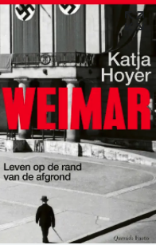

*Een democratie, een beschaving, wordt gemaakt of gaat ten onder door de keuzes die wij als individu en als samenleving maken. Geschiedenis, tradities en cultuur, hoe sterk ook, bieden geen afdoende bescherming tegen een machtsgreep door een meedogenloze totalitaire ideologie. Er is geen betere casus denkbaar om dit te demonstreren dan Weimar in het interbellum.”*\
\> - Katja Hoyer

 

Vorige week was ik in Weimar en dronk een kop thee in Geleitstrasse, dichtbij de Goetheplatz. Ik kwam er achter dat Carl Weidrich hiernaast had gewoond. Carl Weidrich is een van de hoofdrolspelers in het aangrijpende boek *Weimar. Leven op de rand van de afgrond* van Katja Hoyer dat ik net had gelezen en dat kort geleden in de Nederlandse vertaling uitkwam. Carl Weidrich was boekbinder en had zijn winkel in papier, inkt en schrijfwaar daar in die straat. Hij hield meer dan zestig jaar een dagboek bij over wat hij allemaal persoonlijk meemaakte vanaf het moment dat hij in Weimar zijn winkel had gekocht en er op 28 april 1914 kwam te wonen. Weimar, de stad van Goethe en Schiller en de stad ook waar het nationaal socialisme wortel schoot in het hart van Duitsland en uitgroeide tot proeftuin van nazi-ideeën. Het dagboek van deze gewone Duitser was voor Katja Hoyer van onschatbare waarde. Het bood haar een goede inkijk in zijn leven, de maatschappelijke krachten waar hij mee had te maken en de beslissingen die hij had te nemen gedurende het interbellum.

Carl Weidrich is een van de personen die Hoyer jaar voor jaar, van 1914 tot en met 1939, volgt. Via hun de verhalen wil ze ons laten zien hoe individuen en systemen, verantwoordelijkheid en onvermijdelijkheid zich in deze periode ten opzichte van elkaar verhielden. De verhalen laten ons zien hoe mensen toen handelden gehandeld en nadenken over hoe ze beter hadden kunnen handelen en ook hoe kwetsbaar democratie is en hoe belangrijk keuzes zijn die we dagelijks maken. Op basis van dagboeken, brieven en persoonlijke documenten vermengd met politieke en sociale geschiedenis beschrijft Hoyer wat er in Weimar gebeurt in die periode. Ze laat ons zien van jaar tot jaar zien hoe gebeurtenissen in Weimar verlopen vanaf de nederlaag van Duitsland in de Eerste Wereldoorlog, de internationale vernedering die erop volgt met z’n de inflatie en armoede, vervolgens de opkomst en consolidatie van het nationaal-socialisme en het nazibewind.

 

Het uitvoerige dagboek van Carl Weirich, de boekbinder en kantoorboekhandelaar uit de Galeitsestraat, vond Hoyer in het stadsarchief van Weimar toen ze met haar onderzoek begon. Weirichs ervaringen zijn die van plannen maken en ambitie hebben, dierbaren ontmoeten en verliezen, over opnieuw beginnen, over armoede en weer welvaart, over scepsis en steun voor het nationaal-socialisme. Carl Weirich is een hele gewone Duitser en zijn belevenissen door het boek heen (veel hoofdstukken eindigen het jaar met een korte sfeerbepaling van hem) geven het boek menselijke diepgang. Het boek volgt ook andere lotgevallen zoals Rosa en Arthur Schmidt, die jarenlang het Hohenzollern Hotel vlakbij het station van Weimar dreven, waar Hitler eerst nog regelmatig kwam en waar talrijke nazibijeenkomsten werden organiseerden. Je ziet hier hun bierkelder vol zitten met lallende naziaanhangers terwijl Rosa Schmidt er met het dienblaadje tussendoor loopt. Maar Rosa Schmidt was van Joodse afkomst en haar Joodse afkomst konden de Schmidts met succes verborgen houden. Lang wisten de nazi’s niet bij wie ze aan tafel zaten tot dat dit in 1943 werd ontdekt, Rosa Schmidt alsnog naar Auschwitz werd gedeporteerd en daar werd vermoord. Kurt Nehrling is een andere hoofdpersoon, een socialist voor wie het werken in de amtenarij in de dertiger jaren onmogelijk werd gemaakt. Hij was een verzetstrijder en wist lang ondergedoken te overleven totdat zijn kameraden een voor een waren opgepakt, hij uiteindelijk ook werd verraden en in Dachau werd geëxecuteerd. Dan is er nog Elisabeth Förster-Nietzsche, die sinds de jaren 1890 optrad als beheerder, en niet altijd even nauwkeurig als het anders uitkwam, van de nalatenschap van haar broer Friedrich Nietzsche. Zij leidde het Nietzsche-Archief in een villa in een chique buitenwijk van Weimar. Ze had lang met financiële problemen te maken totdat de nazi’s Nietzsche als een geestelijke voorloper omarmden. Zijzelf was een conservatief en monarchist van de oude stempel en had eigenlijk meer met de koning en Mussolini dan met Hitler op. Zij was nooit een nazi, en haar verhouding tot de nazi’s was beleefd maar terughoudend. Toch waren die contacten nauw genoeg om haar vriend Harry Graf Kessler zorgen te baren. Kessler op zijn beurt was een rijke kunstmecenas en ook nog eens een goede dagboekschrijver. Hij kende vrijwel iedereen, ving overal geruchten op en bevond zich vaak op cruciale momenten op de juiste plaats. Ook zijn dagboek leverde Hoyer een overvloed aan materiaal waar ze dankbaar gebruik van heeft gemaakt. In *Weimar* spelen nog talloze andere personen een rol.

Maar deze verhalen zijn er om opgeteld het verhaal van de stad Weimar te vertellen over de jaren 1914-1939. De Eerste Wereldoorlog trof ook de gezinnen in Weimar van wie relatief veel gezinsleden om het leven kwamen of waren getraumatiseerd. Aan die ellende kwam geen einde toen de oorlog voorbij was en ziekte door fabrieken, ziekenhuizen en scholen raasde. Hoyer schrijft dat in de wereld van na 1918 dood, lijden, economische ineenstorting en politieke instabiliteit alomtegenwoordig waren. Maar in 1919 kwamen er ook verkiezingen met een verlaagde kiesleeftijd en met deelname voor het eerst van vrouwen. Er kwam een nieuw democratisch Duitsland, gebaseerd op idealisme en waar kon dat zich beter grondvesten dan in Weimar. In het Nationaaltheater van Weimar kwam het eerste parlement van Duitsland onder leiding van Franz Ebert bijeen en hier werd een nieuw grondwet opgesteld. In datzelfde jaar werd onder leiding van Walter Gropius ook de radicale en behoorlijk arrogante kunsthogeschool Bauhaus opgericht dat interationaal naam zal verwerven en invloed uitoefent op de manier waarop wij in de 20ste eeuw zijn gaan leven. Het optimisme straalde er vanaf.

Maar de consequenties voor Duitsland van de Vrede van Versailles (‘verkrachtingsdocument’, ‘schandalige vrede’) werden ook duidelijk met grote armoede, schuldenproblematiek, geweld en opstanden en de jonge republiek had te maken met grote maatschappelijke en economische problemen. Er is veel woede en wanhoop in de politiek. De nazipartij was tot februari 1925 verboden in Duistland verboden. In Thüringen, het gebied waar Weimar toe behoort, was dat een jaar eerder al opgeheven en kon de partij werken aan z’n beweging. Dat is precies wat er hier gebeurde. In 1924 vond er bijvoorbeeld in Weimar een ‘Conferentie van de Nationaalsocialistische Vrijheidsbeweging’ plaats, met Ludendorff als voorzitter en duizenden aanwezige paramilitairen. En Bauhaus kreeg het steeds moeilijk, zo moeilijk dat Gropius en collega’s besloten naar Dessau te vertrekken. Hitler zat toen nog in de gevangenis. In 1925 koos hij wel Weimar als plaats voor zijn eerste toespraak buiten Beieren. Waar het nieuwe Duitsland was geboren, daar wilde Hitler het weer afbreken. Hier kreeg de jongerenbeweiging de naam Hitlerjugend en werden de swastika en Hitlergroet voor het eerst publiekelijk gebruikt.

In 1930 werd Thüringen de eerste Duitse deelstaat ook waarin een nazi deel uitmaakte van de regering. Ze eisten de verantwoordelijkheid over veiligheidszaken en onderwijs en in mum van tijd werden bestuurlijke, educatieve en culturele instellingen van samenstelling veranderd. In dit gebied werden door de nationaal-socialisten waardevolle lessen geleerd. Wilhelm Frick, door Hitler zelf aangewezen, werd een Rijksdagafgevaardigde die berucht was om zijn antisemitische tirades. In 1932, nadat de nazi’s 42,5 procent van de stemmen hadden behaald, in Weimar zelfs 44 procent, kregen zij de macht in de deelstaat in handen.

Op de eerste dag van Hitlers kanzeliersschap werd er in Weimar een hele grote fakkeloptocht georganiseerd. Er kwam een systematisch getreiter van Joden op gang dat van kwaad tot erger ging. Nazi’s zaaiden terreur in Weimar. Daar werd een martelkamer ingericht en kort nadat Hitler rijkskanselier was geworden, arresteerden de Thüringse autoriteiten een grote groep mensen, grotendeels om politieke redenen. Weimars sombere voortrekkersrol in de steun voor het nazisme werd bevestigd toen in 1937 de nabijgelegen Ettersberg, het gebied waar Goethe altijd zo graag verbleef, werd gekozen als locatie voor Duitslands derde concentratiekamp, dat de idyllische naam Buchenwald (‘beukenbos’) kreeg. Het volgde op Dachau, bij München, en Sachsenhausen, bij Berlijn. Het bos werd gekapt, op één eik na waaronder Goethe volgens de overlevering zou hebben gepicknickt. Deze boom bleef staan tussen de kampkeuken en de wasserij.`<`{=html}

`br>`{=html}

Met duizend andere Duitse burgers werd Carl Weidrich op 16 april 1945 door de Amerikanen verplicht om naar het concentratiekamp te komen en met eigen ogen te zien wat er daar allemaal aan verschrikkelijks had plaatsgevonden. Het concentratiekamp ligt slechts op een paar uur wandelen van Weimar. Hoyer begint en eindigt haar boek met Buchenwald. Zij schetst de smerigheid, de verhongering in het kamp en het willekeurige, ongeremde en meedogenloze geweld waaraan de gevangenen werden blootgesteld. Dit kamp werd in 1937 gebouwd en hier werden 56.000 mensen omgebracht. Carl Weidrich moest de martelwerktuigen zien, de etterende wonden op de uitgemergelde lichamen van gevangenen en de bewijzen van het gruwelijke sadisme van de voormalige kampcommandant Karl Otto Koch en zijn nog ergere vrouw Ilse. Weirich schreef in zijn dagboek: ‘Je moest stalen zenuwen hebben om die vreselijke dingen in het crematorium te aanschouwen, en ook in de barakken, waarin nog steeds gevangenen waren gehuisvest’.

Weidrich schreef in zijn dagboek over zijn dagelijkse beslommeringen, over armoede, trauma’s, honger en verlies. Maar hij schreef niet over verantwoordelijkheid voor wat er gebeurt. Daar dacht hij, net als veel van zijn generatiegenoten, niet over na. Hoewel Hoyer zich onthoudt van moraliseren en ergens de schuld neerleggen, is het volgens haar wel nodig om te begrijpen waarom bepaalde keuzes en fouten zijn gemaakt. De keuzes die individuen en mensen met elkaar voortdurend maken zijn van levensbelang voor een gezond functionerende samenleving.

De twee gezichten van Weimar, die van dichters en beulen, blijft na het lezen van het boek in het geheugen van deze lezer hangen. Dat zie je ook als je door de stad loopt. Hier woonde Goethe, daar Schiller, hier Kandinsky en daar stond het Bauhaus. Maar ook, hier moest het Gauforum komen, hier woonde Carla Wiedrich, hier stond het hotel van Rosa Schmidt, dit is de Kurt Nehrlingstraat en hier een beetje de heuvel op woonde Elisabeth-Förster Nietsche. En een dag later loop ik de stad uit, de lange Bloedstraat over om zo het concentratiekamp Buchenwald binnen te wanelen. Katja Hoyer is een geweldige historische gids.

 

Hoyer, K. (2026). *Weimar. Leven op de rand van de afgrond.* Het Getij/Querido/Facto: Amsterdam/Antwerpen. 511 blz.

 

